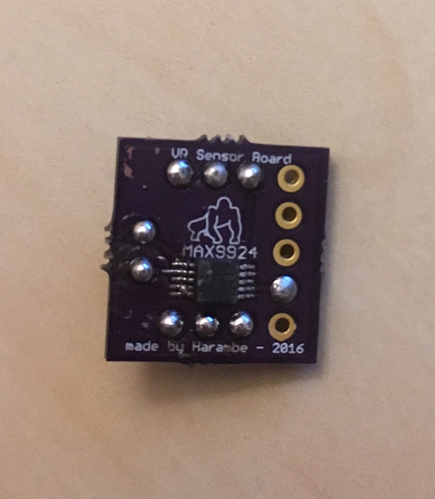
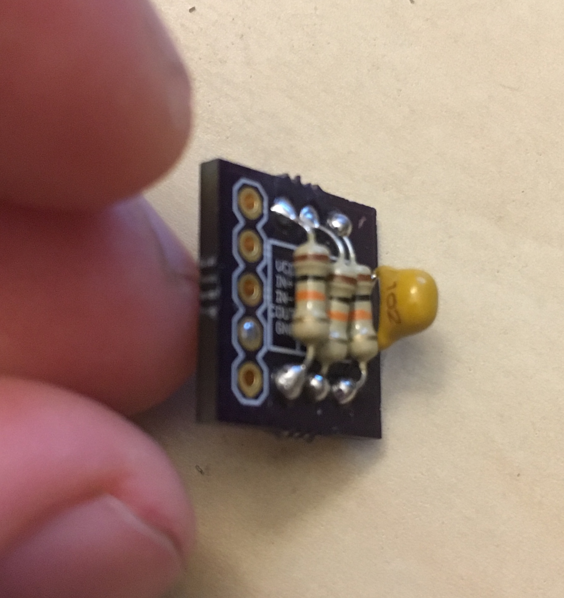

# VariableReluctance_sensorboard
This was my tutorial board that got me into "hardware"/board design.  My roommate was making an ECU for his Volvo 240 and needed a variable reluctance sensor board to detect the position and speed of the engine by monitoring a missing tooth gear on the crankshaft.  So he let me do this as a tutorial since it was simple enough and showed me the PCB design process.

Though my first PCB started with Eagle, I switched to KiCAD soon after (just like many people did since Autodesk acquired Eagle in June 2016).

___
Also did I mention I'm into memes?

